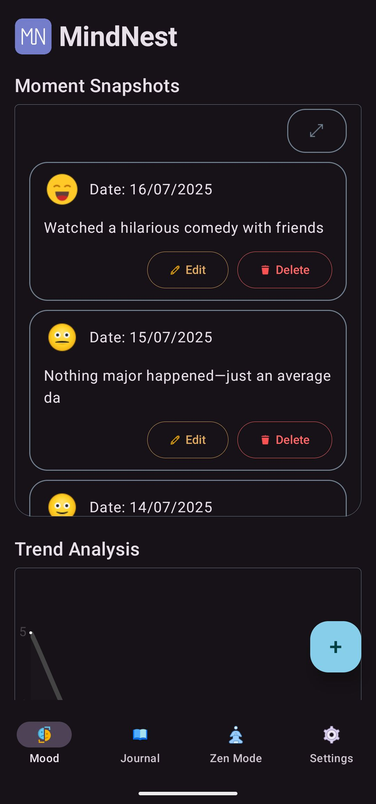
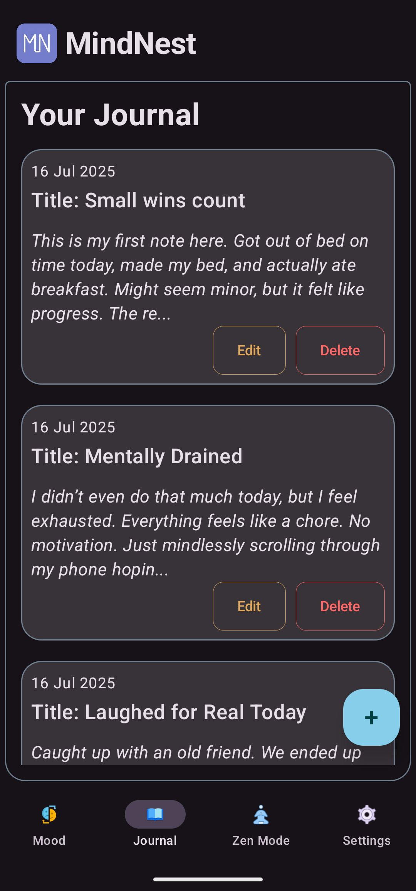
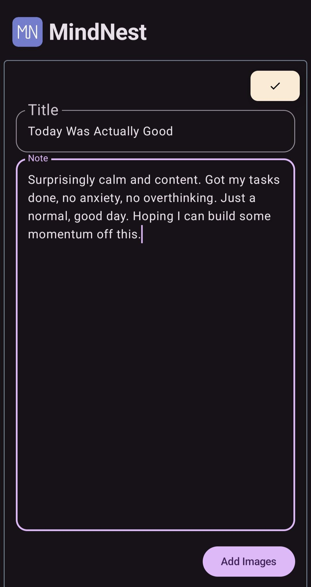
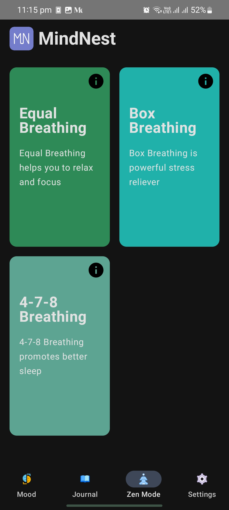

# 🧠 MindNest

MindNest is a mental wellness companion app built for Android.

---

### ✨ Features

- 🟢 **Mood Tracker** — Log and track your emotional states daily
- 📓 **Journal** — Reflect with private, secure journaling
- 🌬️ **Zen Mode** — Simple breathing tools to help you relax
- ⚙️ **Settings** — Manage preferences

---

### 📱 Built With

- Kotlin + Jetpack Compose
- Firebase (Auth, Firestore, etc.) *(in development)*
- MVVM Architecture
- Room DB (for offline journaling)

---

### 📸 Screenshots

#### Mood Tracker
|                                                 |                                                |
|-------------------------------------------------|------------------------------------------------|
|  |  |

#### Journal
|                                       |                                              |
|---------------------------------------|----------------------------------------------|
|  |  |

#### Zen Mode

#### Settings

---

### 🚧 Status

Currently under active development.

---

### 📌 Note

This is a personal mental health project — not a substitute for clinical care.